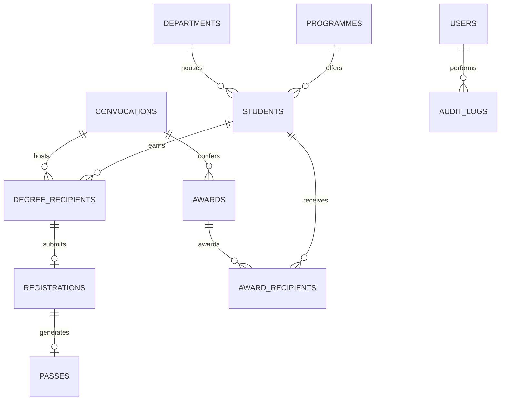

# 🎓 NIT Patna Convocation Digital Platform

[](https://nextjs.org/)
[](https://react.dev/)
[](https://www.typescriptlang.org/)
[](https://tailwindcss.com/)
[](https://www.mysql.com/)
[](#)

> **Official Enterprise Portal for the Annual Convocation Ceremony of National Institute of Technology Patna (राष्ट्रीय प्रौद्योगिकी संस्थान पटना)**.  
> Designed for the **14th Annual Convocation (XIV Convocation 2025)** and engineered as a **multi-year, reusable digital ecosystem** supporting public event showcase, graduate self-service registration, digital QR pass issuance, seating matrix allocation, and administrative governance.

---

## 📌 Table of Contents

1. [Platform Overview](#-platform-overview)
2. [Key Capabilities & Modules](#-key-capabilities--modules)
3. [UI/UX & Feature Breakdown](#-uiux--feature-breakdown)
   - [1. Public Event Website](#1-public-event-website)
   - [2. Student Self-Service Portal & Digital Pass](#2-student-self-service-portal--digital-pass)
   - [3. Admin Management & Approvals Portal](#3-admin-management--approvals-portal)
4. [Design System & Institutional Identity](#-design-system--institutional-identity)
5. [Database Architecture & Schema](#-database-architecture--schema)
6. [API Architecture & Security](#-api-architecture--security)
7. [Tech Stack](#-tech-stack)
8. [Project Structure](#-project-structure)
9. [Getting Started & Local Setup](#-getting-started--local-setup)
10. [Key Route Map](#-key-route-map)
11. [Documentation & Roadmaps](#-documentation--roadmaps)

---

## 🏛 Platform Overview

The **NIT Patna Convocation Digital Platform** replaces static manual souvenir circulation and fragmented registration spreadsheets with an automated, responsive, and secure web application.

- **Institution:** National Institute of Technology Patna (*An Institute of National Importance under Ministry of Education, Govt. of India*).
- **Ceremony Edition:** 14th Annual Convocation (XIV Convocation) — Saturday, December 27, 2025.
- **Chief Guest:** Shri Nitish Kumar, Hon’ble Chief Minister of Bihar.
- **Dignitaries:** Hon'ble President of India Smt. Droupadi Murmu (Visitor), Hon'ble Prime Minister Shri Narendra Modi (Chief Patron), Hon'ble Minister of Education Shri Dharmendra Pradhan (Patron), Shri Ashok Kumar Modi (Chairperson, BOG), and Prof. Pradip Kumar Jain (Director, NIT Patna).
- **Scope:** Multi-year scalable platform supporting B.Tech, B.Arch, M.Tech, MURP, M.Arch, and Ph.D degrees across all 11 academic departments.

---

## ⚡ Key Capabilities & Modules

| Module | Audience | Core Functions |
| :--- | :--- | :--- |
| **Public Information Portal** | Public, Alumni, Press, Families | Hero countdown, interactive 3D flip Chief Guest spotlight, awardees constellation orbit, minute-by-minute schedule, souvenir photo gallery with lightbox, searchable graduate directory, dignitary profiles, help desk & FAQs. |
| **Student Self-Service Portal** | Graduating Students | Roll-number authentication, academic profile verification, in-person vs postal dispatch registration, guest registration (up to 2 guests), real-time status tracker, printable digital entry QR pass with assigned hall block/row/seat. |
| **Admin Management Portal** | Convocation Committees & IT Team | Real-time overview metrics, registration approvals desk (approve/reject/hold), student data management, seating assignment engine, event-day check-in readiness, audit logs, and exportable reports. |
| **Relational Data Core** | System Engine | Multi-year MySQL database schema partitioning student records, degree recipients, registrations, passes, awards, and audit logs by `convocation_id`. |

---

## 🎨 UI/UX & Feature Breakdown

### 1. Public Event Website

#### 🌟 Interactive Hero Section (`HeroSection.tsx`)
- **Institutional Headline & Statistics:** Display title *"Celebrating Excellence"* with live metrics: **14th Edition**, **1,200+ Graduates**, **12+ Medalists**, and **NIRF 53rd Rank** badge.
- **Interactive 3D Flipping Chief Guest Card:** 
  - **Front Face:** High-definition portrait of Hon'ble Chief Minister Shri Nitish Kumar with gold badge and role overlay.
  - **Back Face:** 3D perspective flip (`rotate-y-180`) revealing biography, leadership vision, and dedication of the **125-acre Bihta Campus**.
  - **Interaction:** Flip triggered on hover or direct tap/click with smooth CSS 3D transforms.
- **4-Segment Event Status Announcement Banner:** Color-coded status strip across the bottom:
  1. 🟠 **Important Announcement:** Modal popup trigger displaying the official convocation notification and guidelines.
  2. 🔴 **Full Dress Rehearsal:** Saturday, December 27, 2025 (Mandatory for all medalists/recipients).
  3. 🟣 **Reporting Time:** 08:00 AM Sharp.
  4. 🔵 **Venue:** Main Campus Auditorium, NIT Patna (Ashok Rajpath).

#### 🎖️ Interactive Awardees Constellation Orbit (`AwardeesOrbit.tsx`)
- **Visual Design:** Central golden medallion with concentric ambient light rings and orbiting satellite avatar nodes.
- **Tab Switcher:** Real-time toggle between **Undergraduate (UG)** and **Postgraduate (PG)** medal recipients.
- **Awardee Profiles:** Real souvenir draft photographs, candidate name, roll number, academic department, and medal title (President's Gold Medal, Director's Gold Medal, Rohatgi Medal, Alumni Medals, Certificates of Excellence).
- **Responsive Fallback:** Dynamic orbit for desktop and structured card grid for mobile devices.

#### ⏱️ Day of Ceremony Schedule & Timeline (`CeremonySchedule.tsx` & `/programme`)
- **Vertical Glowing Timeline:** Minute-by-minute order of events from **08:00 AM Arrival** to **06:30 PM High-Tea**.
- **Key Programme Milestones:** Academic Procession arrival, Lamp Lighting & Saraswati Vandana, Director's Report, Address by Chairperson BOG, Address by Chief Guest, Medals Conferral, Solemn Convocation Pledge (*दीक्षान्त प्रतिज्ञा*), and Degree Conferral.
- **3 Guidance Cards:** Ceremonial Dress Code (Kurta-Pyjama / Saree with Institute Stole), Security & Digital Pass verification, and Mandatory Rehearsal notice.
- **Detailed Schedule Modal:** In-depth breakdown with searchable event sequence numbers.

#### 🖼️ Glimpse of Convocation Photo Gallery (`ConvocationGallery.tsx`)
- **8-Grid Ceremonial Moments:** Showcasing medal distribution, red carpet entrance, academic procession of Senate members, keynote address, institutional citations, and graduate batch assembly.
- **Custom High-Fidelity SVG Scenes:** Custom vector illustrations and ambient lighting reflecting authentic convocation scenes.
- **Interactive Lightbox:** Full-screen modal with Next/Previous photo navigation, keyboard controls, and category captions.

#### 👥 Dignitaries on Dias Page (`/dignitaries`)
- **Profiles of Leadership:** High-definition portraits and official designations for President of India Smt. Droupadi Murmu, Prime Minister Shri Narendra Modi, Education Minister Shri Dharmendra Pradhan, Chief Minister Shri Nitish Kumar, BOG Chair Shri Ashok Kumar Modi, and Director Prof. Pradip Kumar Jain.
- **Institutional Milestone Spotlight:** Historical dedication of the 125-acre Bihta Campus.
- **Administrative Section:** Directory of all Institute Deans and Registrar.

#### 🏆 Medals & Honours Directory (`/awards`)
- **Special Honors Spotlight:** 
  - 🥇 **Best Graduate (Boy):** Thandava Purandeswar Reddy (CSE) — ₹10,001/- cash prize + Letter of Appreciation.
  - 🥇 **Best Graduate (Girl):** Anand Setu (Architecture) — ₹10,001/- cash prize + Letter of Appreciation.
- **Detailed Departmental Breakdown:** Complete lists of all UG Branch Toppers, PG Overall & Branch Toppers, and citation details.

#### 🔍 Searchable Graduate Directory (`/graduates`)
- **Live Search Engine:** Real-time client-side and API-backed instant filtering by student name, roll number, or department.
- **Multi-Level Filters:** Filter by Academic Programme (`B.Tech`, `B.Arch`, `M.Tech`, `PGPAP/M.Arch`, `Ph.D`) and Department (`CSE`, `Civil`, `Electrical`, `Mechanical`, `ECE`, `Architecture`, `Applied Physics`).
- **Ph.D Scholar Register:** Authentic souvenir draft photographs of doctoral scholars with research department designations.
- **Card Badges:** Special honor tags, degree titles, and institute email addresses.

#### ☎️ Help Desk & FAQ Section (`HelpDeskSection.tsx`)
- **Direct Helplines:** Email desk (`convocation@nitp.ac.in`), Academic Section phone lines (`+91 612 237 1715 / 0180`), and physical office location.
- **Expandable Accordion FAQs:** Clear guidance on mandatory attire, digital pass issuance, guest quotas, and degree packet collection.

---

### 2. Student Self-Service Portal & Digital Pass

#### 👤 Student Dashboard (`/student`)
- **Candidate Verification:** Instant confirmation of eligibility, roll number, department, and degree category.
- **4-Stage Visual Lifecycle Progress Tracker:**
  $$\text{1. Profile Verified} \longrightarrow \text{2. Registered} \longrightarrow \text{3. Admin Approved} \longrightarrow \text{4. Pass Issued}$$
- **Advisory Banner:** Confirmed registration status notice with allocated seating coordinates.

#### 📝 Convocation Registration Workflow (`/student/register`)
- **Attendance Choice:** In-Person ceremony attendance vs Postal Degree Dispatch.
- **In-Person Details:** Accompanying guest count selector (0, 1, or 2 guests) and special assistance requests.
- **Postal Dispatch Details:** Full postal mailing address and PIN code validation for candidates unable to attend.
- **Submission Feedback:** Instant confirmation screen and database sync.

#### 🎟️ Official Digital QR Entry Pass (`/student/pass`)
- **Official Security Layout:** High-resolution NIT Patna emblem, watermark, pass identifier (`NITP-CONV25-XXXXX`), and verified badge.
- **Allocated Seating Coordinates:** Distinct display of assigned **Hall Block** (e.g., `Block A`), **Row Number** (`Row 03`), and **Seat Number** (`Seat 14`).
- **Scannable Barcode / QR Section:** Unique QR token placeholder for gate entry and attendance logging.
- **Print & PDF Export:** One-click print optimization formatted specifically for A4 pass printing via `@media print`.

---

### 3. Admin Management & Approvals Portal

#### 📊 Admin Overview Dashboard (`/admin`)
- **Key Metrics KPI Bar:** Total Eligible Graduates (`1,250`), Registrations Submitted (`942`), Passes Generated (`810`), and Checked-In Count.
- **Recent Registrations Table:** Quick-look table with status badges (`Approved`, `Pending Review`, `Action Required`).
- **Action Items & Alerts:** Notification feed for unassigned seating blocks, pending identity reviews, and CSV import prompts.

#### ✅ Registration Approvals Desk (`/admin/registrations`)
- **Status Filter Tabs:** Instant sorting by `ALL`, `SUBMITTED`, `APPROVED`, or `REJECTED`.
- **Search & Inspection:** Search across applicants with real-time tabular updates.
- **One-Click Actions:** Fast Approve (`✓`) or Reject (`✗`) buttons with optimistic UI state changes.
- **Bulk Action Capabilities:** Infrastructure ready for mass-approval of verified cohorts.

---

## 🎨 Design System & Institutional Identity

The user interface adopts a dignified, academic, and accessible design system aligned with NIT Patna's institutional identity and WCAG AA standards:

| Token / Element | Value / Code | Application |
| :--- | :--- | :--- |
| **Primary Brand Color** | Crimson / Maroon (`#8B0000` / `#9C2626`) | Main headers, navigation accents, primary buttons, borders |
| **Accent Color** | Amber / Gold (`#F59E0B` / `#FFD700`) | Medals, badges, orbit rings, call-to-actions, highlights |
| **Canvas Background** | Warm Off-White (`#FBF9F5` / `#F8F9FA`) | Main application canvas, card containers |
| **Dark Accents** | Deep Navy / Slate (`#0F172A` / `#1E293B`) | Ceremony timeline background, footer, typography |
| **Headings Font** | Serif (`font-serif`, Playfair / Merriweather) | Dignified titles, ceremonial greetings, diplomas |
| **Body & UI Font** | Modern Sans-Serif (`font-sans`, Inter / Geist) | Data tables, directories, forms, pass details |

---

## 🗄️ Database Architecture & Schema

The platform is backed by a normalized, relational MySQL schema designed for multi-year reusability. All transactional records are linked through `convocation_id`:



### Table Definitions Summary (`db/schema.sql`)
1. **`Convocations`**: `id`, `edition_number` (e.g. 'XIV'), `year`, `ceremony_date`, `venue`, `status` (`UPCOMING`, `ACTIVE`, `ARCHIVED`).
2. **`Departments`** & **`Programmes`**: Master academic reference tables.
3. **`Students`**: Immutable core student identity records (`roll_number`, `full_name`, `email`, `phone`).
4. **`Degree_Recipients`**: Convocation mapping with `cgpa` and `passing_year`.
5. **`Registrations`**: `status` (`DRAFT`, `SUBMITTED`, `APPROVED`, `REJECTED`), `attending_in_person`, `guest_count`, `dispatch_address`, `admin_remarks`.
6. **`Passes`**: `qr_code_hash`, `block_name`, `row_number`, `seat_number`, `is_scanned`, `scanned_at`.
7. **`Awards`** & **`Award_Recipients`**: Gold medal categories, certificate rankings, and student recipients.
8. **`Users`** & **`Audit_Logs`**: Role-based administration accounts (`SUPER_ADMIN`, `REGISTRATION_ADMIN`, etc.) with JSON-based delta audit logging.

---

## 🔌 API Architecture & Security

The platform exposes dedicated Next.js App Router API endpoints with clear public vs. private data segregation:

- **Public Endpoints (`/api/graduates`)**:
  - `GET /api/graduates`: Supports parameterized search (`search`, `departmentId`, `programmeId`, `page`, `limit`).
- **Student Endpoints (`/api/student/*`)**:
  - `GET /api/student/register`: Fetches the active candidate's registration status.
  - `POST /api/student/register`: Validates and commits in-person or postal dispatch preferences.
- **Admin Endpoints (`/api/admin/*`)**:
  - `GET /api/admin/registrations`: Returns paginated registration applications with status filtering.
- **Authentication (`/api/auth/[...nextauth]`)**:
  - NextAuth JWT-session credentials provider for roll-number and admin role authentication.

---

## 💻 Tech Stack

- **Framework:** Next.js 16 (App Router, Server Components & Client Hydration)
- **Frontend Library:** React 19
- **Language:** TypeScript 5
- **Styling:** Tailwind CSS v4 + Custom 3D CSS utilities
- **Icons:** Lucide React (`lucide-react`)
- **Database Engine:** MySQL 8.0 / MySQL2 Promise Pool (compatible with local MySQL & Cloud SQL / TiDB)
- **Authentication:** NextAuth.js
- **Validation:** Zod

---

## 📁 Project Structure

```text
convocation-nitp/
├── db/
│   └── schema.sql                 # Production MySQL Database DDL Schema
├── public/
│   ├── logo.png                   # Official NIT Patna Emblem Logo
│   └── images/
│       └── souvenir/              # High-Res Extracted Souvenir Assets
│           ├── droupadi_murmu.png
│           ├── narendra_modi.png
│           ├── nitish_kumar_hd.png
│           ├── ug_*.png           # UG Gold Medalist Portraits
│           ├── pg_*.png           # PG Gold Medalist Portraits
│           └── phd/               # Ph.D Doctoral Scholar Portraits
├── src/
│   ├── app/
│   │   ├── admin/                 # Admin Portal (Dashboard & Approvals)
│   │   │   ├── page.tsx
│   │   │   ├── layout.tsx
│   │   │   └── registrations/page.tsx
│   │   ├── api/                   # API Route Handlers
│   │   │   ├── admin/registrations/route.ts
│   │   │   ├── auth/[...nextauth]/route.ts
│   │   │   ├── graduates/route.ts
│   │   │   └── student/register/route.ts
│   │   ├── awards/page.tsx        # Awards & Medalists Directory
│   │   ├── dignitaries/page.tsx     # Dignitaries on Dias & Bihta Campus
│   │   ├── graduates/page.tsx     # Searchable Graduate Directory
│   │   ├── programme/page.tsx     # Day of Ceremony Schedule & Timeline
│   │   ├── student/               # Student Portal & Digital Pass
│   │   │   ├── page.tsx
│   │   │   ├── layout.tsx
│   │   │   ├── pass/page.tsx
│   │   │   └── register/page.tsx
│   │   ├── globals.css            # Theme Tokens & 3D CSS Styles
│   │   ├── layout.tsx             # Root Layout
│   │   └── page.tsx               # Convocation Home Page
│   ├── components/
│   │   ├── AwardeesOrbit.tsx          # Constellation Orbit for Medalists
│   │   ├── CeremonySchedule.tsx       # Order of Events Timeline & Modal
│   │   ├── ConvocationGallery.tsx     # Photo Grid & Lightbox Viewer
│   │   ├── Footer.tsx                 # Institutional Footer
│   │   ├── HelpDeskSection.tsx        # FAQs & Support Desk
│   │   ├── HeroSection.tsx            # 3D Flip Card Hero & Metrics
│   │   └── Navbar.tsx                 # Bilingual Sticky Header
│   └── lib/
│       ├── auth.ts                # NextAuth Configuration
│       ├── db.ts                  # MySQL Connection Pool & Query Helper
│       └── souvenirData.ts        # Official 2025 Souvenir Data Store
├── package.json
└── tsconfig.json
```

---

## 🚀 Getting Started & Local Setup

### 1. Prerequisites
- **Node.js**: v18.18+ or v20+
- **npm** / **yarn** / **pnpm** / **bun**
- **MySQL Server** (Optional for local development; frontend includes built-in mock fallbacks)

### 2. Installation
```bash
# Clone the repository
git clone https://github.com/your-repo/convocation_nitp.git
cd convocation_nitp/convocation-nitp

# Install dependencies
npm install
```

### 3. Environment Configuration
Create a `.env` file in `convocation-nitp/`:
```env
# Database Configuration
DB_HOST=localhost
DB_USER=root
DB_PASSWORD=your_password
DB_NAME=convocation_db
DB_PORT=3306

# NextAuth Security
NEXTAUTH_URL=http://localhost:3000
NEXTAUTH_SECRET=your_super_secret_jwt_key
```

### 4. Database Setup (Optional)
Initialize your local MySQL database using the provided schema:
```bash
mysql -u root -p < db/schema.sql
```

### 5. Running the Development Server
```bash
npm run dev
```
Open [http://localhost:3000](http://localhost:3000) in your browser to view the application.

---

## 📖 Key Route Map

| URL Route | Purpose / View |
| :--- | :--- |
| [`/`](http://localhost:3000/) | **Convocation Home**: Hero 3D card, Medalists orbit, schedule timeline, gallery, FAQs |
| [`/programme`](http://localhost:3000/programme) | **Programme & Schedule**: Minute-by-minute ceremonial order, dress code, pledge |
| [`/awards`](http://localhost:3000/awards) | **Medals & Honours**: Best Graduate Boy/Girl, UG/PG Gold Medalists |
| [`/graduates`](http://localhost:3000/graduates) | **Graduate Directory**: Searchable register with filters and Ph.D portraits |
| [`/dignitaries`](http://localhost:3000/dignitaries) | **Dignitaries on Dias**: Patrons, Chief Guest, BOG Chair, Director, Deans |
| [`/student`](http://localhost:3000/student) | **Student Dashboard**: Application progress, pass link, advisories |
| [`/student/register`](http://localhost:3000/student/register) | **Registration Form**: In-person attendance vs postal degree dispatch form |
| [`/student/pass`](http://localhost:3000/student/pass) | **Digital Pass**: Printable entry pass with QR code & seating coordinates |
| [`/admin`](http://localhost:3000/admin) | **Admin Dashboard**: Operational metrics, recent applications, alerts |
| [`/admin/registrations`](http://localhost:3000/admin/registrations) | **Registration Approvals**: Searchable approval queue with 1-click review |

---

## 📚 Documentation & Specifications

Detailed architectural documentation is available in the [`docs/`](../docs) folder:
- [Phase 1: Project Scope, Sitemaps & Flowcharts](../docs/phase_1_requirements.md)
- [Phase 4 & 5: Functional UX Specs & Wireframes](../docs/phase_4_5_functional_ux_specs.md)
- [Phase 6: Data Model & Database Design](../docs/phase_6_database_design.md)
- [Phase 7: System Architecture & API Design](../docs/phase_7_system_architecture.md)

---

## ⚖️ License & Acknowledgements

- **Developed for:** National Institute of Technology Patna (राष्ट्रीय प्रौद्योगिकी संस्थान पटना).
- **Ceremony:** 14th Annual Convocation (December 27, 2025).
- All institutional insignia, heraldry, and dignitary likenesses are property of their respective administrative authorities.
